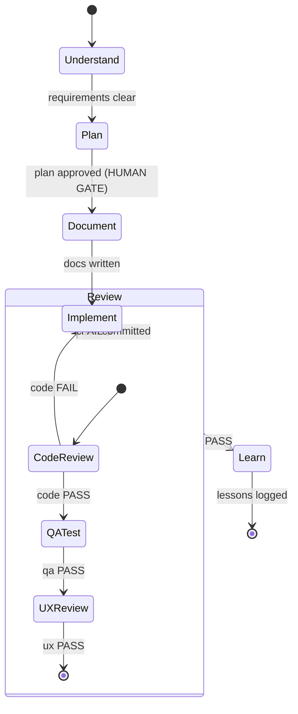

# Research: Programmatic System Prompt Generation

## Framework Comparison

### 1. CrewAI — Role-Goal-Backstory Composition

CrewAI uses a **three-attribute template model** for agent prompt composition:

- **`role`**: Defines function and expertise ("Senior Backend Engineer")
- **`goal`**: Individual objective guiding decisions ("Implement maintainable Rust services")
- **`backstory`**: Context and personality ("15 years of systems programming experience...")

The framework provides three customizable template parameters:

- `system_template` — core behavior
- `prompt_template` — input structure
- `response_template` — output format

Templates support variable interpolation: `{role}`, `{goal}`, `{backstory}` are automatically populated at execution time. The composition is **static per agent definition** — the same agent always gets the same base prompt. Task-specific context is injected separately via the task's description and expected output.

**Strengths**: Simple mental model, easy to author, deterministic composition.
**Weaknesses**: No conditional sections, no knowledge-graph-driven injection, limited dynamic composition. The backstory is a flat string — no structured knowledge loading.

**Relevance to OrqaStudio**: CrewAI's role/goal/backstory maps to OrqaStudio's agent-type/task-scope/knowledge model, but OrqaStudio needs more dynamic composition than CrewAI offers.

### 2. AutoGen (Microsoft) — Message-Passing Architecture

AutoGen takes a fundamentally different approach: **prompts emerge from message sequences**, not from templates.

- Agents are initialized with a `system_message` parameter (a flat string)
- Context accumulates through asynchronous message passing between agents
- The framework uses the Actor Model — each agent encapsulates its own state
- `MultiModalMessage` objects compose text, images, and tool outputs dynamically

AutoGen v0.4+ (2025-2026) shifted to event-driven architecture with:

- Drag-and-drop workflow design (AutoGen Studio)
- Privacy safeguards (Maris) for inter-agent message flow control
- Declarative agent definition via JSON/YAML

**Strengths**: Natural accumulation of context through conversation, multimodal support, event-driven architecture.
**Weaknesses**: System message is still a flat string with no structured composition. Dynamic context comes from conversation flow, not from prompt generation. No template system for programmatic assembly.

**Relevance to OrqaStudio**: The message-passing model is instructive for how task context accumulates, but OrqaStudio's prompt generation needs to be more deterministic — composing from knowledge artifacts rather than conversation history.

### 3. LangGraph (LangChain) — Node-Based Prompt Rebuilding

LangGraph uses a **graph-of-nodes architecture** where each node can have its own prompt, and prompts can be rebuilt on every invocation:

- `StateGraph` defines the workflow as nodes and edges
- Each node can modify state and rebuild prompts based on current state
- **Progressive skill loading**: The prompt is rebuilt on every agent node call, so newly added skills appear without restarting
- The system prompt includes a structured list of available skills (name, description, tags, supporting files)
- Edges carry predicates on global state, enabling conditional routing

A key pattern from LangGraph community practice (Pessini, 2026): **"Stop Stuffing Your System Prompt"** — instead of one massive prompt, use a skill registry that the prompt references by name/description. The full skill content is loaded on-demand, not embedded in every request.

**Strengths**: Dynamic prompt composition tied to workflow state, skill registry pattern, conditional routing, efficient state management.
**Weaknesses**: Graph definition is code, not data — harder to generate programmatically from plugin metadata. Prompt composition logic is scattered across node definitions.

**Relevance to OrqaStudio**: The progressive skill loading pattern and skill registry are directly applicable. The prompt-per-node model maps to OrqaStudio's workflow-stage-specific prompts.

### 4. MetaGPT — SOP-Encoded Prompt Sequences

MetaGPT uses **Standard Operating Procedures (SOPs) encoded as prompt sequences**:

- Each role (Product Manager, Architect, Programmer, QA) gets a separate system prompt
- Agents subscribe to messages in a shared message pool based on their role
- Each role has a prescribed output format (PRD, architecture doc, code, test report)
- The SOP defines the *sequence* of prompts, not just individual prompts
- AFlow (2025): Automated agentic workflow generation — optimizes the workflow graph itself

**Strengths**: The SOP metaphor is closest to OrqaStudio's governance model. Output format enforcement per role. Assembly-line paradigm naturally decomposes complex tasks.
**Weaknesses**: SOPs are relatively rigid — changing the process means changing the prompt sequence. Less dynamic than LangGraph's node-based approach.

**Relevance to OrqaStudio**: The SOP-as-prompt-sequence concept maps directly to OrqaStudio's workflow stages. Each stage becomes a prompt template with defined inputs/outputs. The output format enforcement per role is already part of OrqaStudio's agent design.

### 5. DSPy (Stanford) — Compiled Prompt Optimization

DSPy takes the most radical approach: **prompts are compiled, not authored**.

- Developers write Python modules with natural language signatures
- The framework automatically generates and optimizes prompts through Bayesian optimization
- Optimizers (MIPROv2, COPRO, SIMBA, GEPA) test 100-500 prompt variations
- Few-shot examples are automatically selected and injected
- The compiled prompt can be exported and inspected

**Strengths**: Removes human prompt authoring entirely for task-specific prompts. Provably optimal for a given metric. Automatic few-shot selection.
**Weaknesses**: Requires a training dataset and evaluation metric. Compilation cost ($20-50 per pipeline). Not well-suited for governance/behavioral prompts where "correctness" is hard to measure. Opaque — the generated prompt may not be human-readable.

**Relevance to OrqaStudio**: DSPy's compilation model could optimize task-specific prompt sections (like tool descriptions or output format instructions), but behavioral and governance sections need to be human-authored and auditable. A hybrid approach — compiled task sections + authored governance sections — is worth considering for future optimization.

### Summary Matrix

| Framework | Composition Model | Dynamic? | Knowledge Injection | Workflow Awareness | Token Efficiency |
| ----------- | ------------------ | ---------- | -------------------- | -------------------- | ----------------- |
| CrewAI | Template interpolation | Static per agent | Flat backstory string | Via task, not prompt | Low (full backstory always included) |
| AutoGen | Message accumulation | Dynamic via conversation | Via message passing | Implicit in conversation | Medium (grows with history) |
| LangGraph | Node-based rebuild | Dynamic per invocation | Skill registry + on-demand | Explicit graph state | High (only relevant skills loaded) |
| MetaGPT | SOP sequences | Semi-static per role | Role-specific subscriptions | SOP defines sequence | Medium (full SOP per role) |
| DSPy | Compiled optimization | Static after compilation | Auto-selected examples | Not workflow-aware | High (optimized by compiler) |

---

## Prompt Template Architecture Options

### Option A: Text Template Interpolation (Jinja2/Handlebars Style)

**Mechanism**: Markdown or text files with placeholder variables (`{{ agent_role }}`, `{{ knowledge_sections }}`) resolved at generation time.

```text
# System Prompt

You are a {{ agent.role }}.

## Your Capabilities
{{ for cap in agent.capabilities }}
- {{ cap.name }}: {{ cap.description }}
{{ endfor }}

## Active Rules
{{ for rule in applicable_rules }}
### {{ rule.title }}
{{ rule.content }}
{{ endfor }}

## Task
{{ task.description }}

## Acceptance Criteria
{{ for criterion in task.acceptance }}
- {{ criterion }}
{{ endfor }}
```

**Pros**:

- Human-readable templates, easy to author and review
- Familiar syntax (Jinja2 is industry standard)
- Templates are auditable — you can see exactly what will be generated
- Easy to version control (templates are text files)
- Conditional sections via `` blocks

**Cons**:

- No type safety — a missing variable produces silent empty output
- Complex logic (sorting, filtering, priority ordering) is awkward in template syntax
- Templates can grow unwieldy as conditional branches multiply
- No built-in dependency tracking — template doesn't know when its inputs change

**Best for**: Systems where templates are relatively stable and the composition logic is simple (most sections are either included or excluded based on flags).

### Option B: Programmatic Composition (Builder Pattern)

**Mechanism**: Code constructs the prompt by assembling typed section objects through a builder API.

```typescript
interface PromptSection {
  id: string;
  priority: number;      // determines ordering
  required: boolean;     // must-include vs optional
  tokenBudget?: number;  // max tokens for this section
  content: string;       // resolved content
}

class PromptBuilder {
  private sections: PromptSection[] = [];

  addIdentity(agent: AgentType): this { ... }
  addKnowledge(artifacts: Knowledge[]): this { ... }
  addRules(rules: Rule[], taskContext: TaskContext): this { ... }
  addWorkflow(workflow: WorkflowDefinition): this { ... }
  addTaskContext(task: Task): this { ... }

  build(tokenLimit: number): string {
    // Sort by priority
    // Trim optional sections if over budget
    // Return assembled prompt
  }
}
```

**Pros**:

- Type-safe — missing inputs are compile-time errors
- Complex filtering/sorting/prioritization logic is natural in code
- Token budget management is built-in (can trim low-priority sections)
- Dependency tracking is explicit (function arguments)
- Testable — unit test each section builder independently

**Cons**:

- Prompts are not human-readable without running the code
- Harder for non-developers to modify prompt structure
- Code changes require recompilation (in Rust/TypeScript)
- Risk of over-engineering the builder API

**Best for**: Systems with complex composition logic, token budget constraints, and many conditional sections. The primary approach for production systems.

### Option C: Declarative Composition (Schema-Driven Assembly)

**Mechanism**: A JSON/YAML schema defines which sections to include, their order, and their source artifacts. A generic assembler reads the schema and builds the prompt.

```yaml
# prompt-schema.yaml for "backend-implementer"
sections:
  - type: identity
    source: agent://implementer
    required: true

  - type: knowledge
    source: knowledge://rust-patterns
    condition: task.area == "backend"
    priority: 1

  - type: knowledge
    source: knowledge://svelte5-patterns
    condition: task.area == "frontend"
    priority: 1

  - type: rules
    source: rules://active
    filter: "relevance(task.description) > 0.5"
    max_tokens: 2000

  - type: workflow
    source: workflow://current-stage
    required: true

  - type: task
    source: task://current
    required: true
```

**Pros**:

- Prompt structure is data, not code — can be modified without recompilation
- Plugin-friendly — plugins add entries to the schema, assembler handles the rest
- Auditable — the schema shows exactly what will be composed
- Extensible — new section types don't require code changes to the assembler
- Natural fit for OrqaStudio's artifact graph (sections reference graph nodes)

**Cons**:

- The generic assembler must handle all edge cases (missing sources, token overflow, circular references)
- Schema language needs to be expressive enough for conditional logic
- Two levels of indirection: schema → assembler → prompt (harder to debug)
- Risk of the schema becoming its own DSL that's as complex as code

**Best for**: Plugin-driven systems where the prompt structure must be extensible without code changes. The natural fit for OrqaStudio.

### Recommended Approach: Hybrid (Option C + Option B)

Use **declarative schemas** (Option C) for the *structure* — which sections to include, their ordering, and their sources. Use **programmatic builders** (Option B) for *section content* — resolving knowledge artifacts, filtering rules, formatting workflow state. This gives:

- Plugin extensibility (schemas are data)
- Type safety and token management (builders are code)
- Auditability (schemas show structure, builders are testable)

---

## Token Efficiency Techniques for Prompt Composition

### 1. Priority-Based Section Trimming

Assign each prompt section a priority level. When the total prompt exceeds the token budget, trim from lowest priority up:

| Priority | Section Type | Trim Strategy |
| ---------- | ------------- | --------------- |
| P0 (never trim) | Identity, workflow stage, task description | Always included |
| P1 (trim last) | Active rules, acceptance criteria | Summarize if over budget |
| P2 (trim if needed) | Knowledge artifacts | Include most relevant only |
| P3 (trim first) | Examples, historical context | Drop entirely if over budget |

**Measured impact**: Modular prompting cut token use from 3,200 to 1,850 in documented tests — a 42% reduction.

### 2. Structured Notation for Workflow Embedding

Use **Mermaid statechart notation** instead of prose to represent workflows. Token efficiency comparison:

| Format | Tokens (simple diagram) | Tokens (complex workflow) | LLM Comprehension |
| -------- | ------------------------ | -------------------------- | ------------------- |
| Prose description | ~200 | ~800 | Good but verbose |
| Mermaid | ~50 | ~200 | Excellent |
| YAML | ~80 | ~350 | Good |
| JSON | ~120 | ~500 | Moderate |
| XML | ~300 | ~1,200 | Poor (metadata overhead) |

**Mermaid is 4x more token-efficient than prose and 24x more efficient than XML/JSON** for representing the same workflow information. LLMs parse Mermaid natively and can reason about state transitions from Mermaid notation.

### 3. Skill Registry Pattern (From LangGraph Community)

Instead of embedding full knowledge in every prompt, use a **compact skill registry**:

```text
## Available Knowledge
- rust-error-patterns: Error composition with thiserror (invoke if touching error types)
- svelte5-runes: Reactive state with $state/$derived/$effect (invoke if touching stores/components)
- ipc-patterns: Tauri invoke() contracts (invoke if crossing frontend-backend boundary)
```

Each entry is ~20 tokens. Full knowledge artifacts are 500-2000 tokens each. A registry of 10 skills costs ~200 tokens vs ~10,000 tokens for embedding all knowledge. The agent requests specific knowledge when needed via tool calls.

**Trade-off**: Requires an extra round-trip to load knowledge. Best when most knowledge won't be needed for a given task. For critical, always-needed knowledge, embed directly.

### 4. Rule Compression

Transform verbose rule prose into compact constraint tables:

**Before (verbose, ~150 tokens)**:

```text
When writing Rust code, you must never use unwrap() or expect() in production code.
All functions must return Result types. Use thiserror for error definition.
No panic!() calls are allowed outside of test modules.
```

**After (compressed, ~60 tokens)**:

```text
## Rust Constraints
| FORBIDDEN | REQUIRED |
|-----------|----------|
| unwrap(), expect(), panic!() | Result<T,E> return types |
| silent error swallowing | thiserror for error defs |
```

Tables are 40-60% more token-efficient than prose for constraint lists while maintaining LLM comprehension.

### 5. Conditional Section Loading

Only include sections relevant to the current task:

```text
if task.area == "backend":
  include: rust-patterns, error-composition, ipc-patterns
  exclude: svelte-patterns, component-extraction
elif task.area == "frontend":
  include: svelte-patterns, component-extraction, store-patterns
  exclude: rust-patterns, error-composition
```

This prevents loading 5,000 tokens of Rust patterns for a frontend-only task. Expected savings: 30-50% of knowledge section tokens.

### 6. Role Prompting Efficiency

Research shows role prompting alone cuts token use by 25-30% because the model requires fewer clarifying instructions when it has a clear identity. A well-defined role section (50 tokens) replaces scattered behavioral instructions that would otherwise require 150-200 tokens.

### Combined Impact Estimate

| Technique | Token Savings | Implementation Complexity |
| ----------- | -------------- | -------------------------- |
| Priority trimming | 20-40% | Medium (requires priority assignment) |
| Mermaid for workflows | 75% of workflow section | Low (format change only) |
| Skill registry | 80% of knowledge section | Medium (requires tool call support) |
| Rule compression | 40-60% of rules section | Low (format change only) |
| Conditional loading | 30-50% of knowledge section | Medium (requires task metadata) |
| Role prompting | 25-30% overall | Low (identity section) |

---

## Workflow Embedding Strategies for the Orchestrator Prompt

### Strategy 1: Mermaid Statechart Embedding

Embed the workflow as a Mermaid state diagram directly in the system prompt:



**Token cost**: ~120 tokens for a complete workflow with substates.
**Equivalent prose**: ~500 tokens.

**Pros**: Extremely token-efficient, LLMs understand Mermaid natively, visually inspectable by humans.
**Cons**: Complex conditional logic is hard to express, no room for detailed gate descriptions.

### Strategy 2: Compact Table Notation

Represent the workflow as a state transition table:

```text
## Workflow

| State | Entry Gate | Agent Role | Exit Gate | Next State |
|-------|-----------|------------|-----------|------------|
| understand | task assigned | Researcher | requirements mapped | plan |
| plan | requirements clear | Planner | HUMAN: plan approved | document |
| document | plan approved | Writer | docs reviewed | implement |
| implement | docs exist | Implementer | code committed | review |
| review | code committed | Reviewer | PASS verdict | learn |
| review | code committed | Reviewer | FAIL verdict | implement |
| learn | review PASS | Orchestrator | lessons logged | done |
```

**Token cost**: ~150 tokens.
**Pros**: Easy to parse, all transitions visible at a glance, gate conditions explicit.
**Cons**: Substates require additional tables, complex branching creates many rows.

### Strategy 3: Compact YAML Notation

```yaml
workflow:
  stages:
    understand: { role: researcher, gate: requirements-mapped, next: plan }
    plan: { role: planner, gate: "HUMAN:approved", next: document }
    document: { role: writer, gate: docs-reviewed, next: implement }
    implement: { role: implementer, gate: code-committed, next: review }
    review:
      role: reviewer
      outcomes:
        PASS: learn
        FAIL: implement
    learn: { role: orchestrator, gate: lessons-logged, next: done }
  human_gates: [plan.gate]
```

**Token cost**: ~130 tokens.
**Pros**: Structured data LLMs parse well, extensible, supports metadata.
**Cons**: YAML indentation sensitivity, less visually intuitive than Mermaid.

### Recommended Strategy: Mermaid + Table Hybrid

Use **Mermaid** for the overall flow (visual structure) and **a compact table** for gate details (precise conditions). This gives the LLM both the spatial understanding of the workflow and the precise transition rules:

```text
## Workflow
stateDiagram-v2
  [*] --> understand --> plan --> document --> implement --> review
  review --> learn: PASS
  review --> implement: FAIL
  learn --> [*]

## Gates
| Transition | Gate Type | Condition |
|-----------|-----------|-----------|
| plan → document | HUMAN | User approves plan |
| review → learn | AUTO | All reviewers PASS |
| review → implement | AUTO | Any reviewer FAIL |
```

**Total token cost**: ~180 tokens for a complete workflow specification.
**Equivalent prose**: ~800+ tokens.

---

## Recommended Prompt Generation Pipeline for OrqaStudio

### Architecture Overview

```text
Plugin Registry → Schema Assembly → Section Resolution → Token Budgeting → Prompt Output
```

### Stage 1: Schema Assembly

When a plugin is installed or knowledge changes, the system assembles a **prompt schema** per agent type:

```typescript
interface PromptSchema {
  agentType: string;
  sections: SectionDefinition[];
}

interface SectionDefinition {
  id: string;
  type: 'identity' | 'knowledge' | 'rules' | 'workflow' | 'task' | 'examples';
  source: string;        // artifact graph ID or path
  priority: number;      // P0-P3 for token budgeting
  required: boolean;
  condition?: string;    // when to include (e.g., "task.area == 'backend'")
  maxTokens?: number;    // per-section budget cap
}
```

Schemas are **declarative** — plugins add section definitions, the core assembler doesn't change.

### Stage 2: Section Resolution

At delegation time, the assembler resolves each section:

1. **Identity**: Read agent type definition → extract role description, boundaries, output format
2. **Knowledge**: Query artifact graph for applicable knowledge → filter by task area → rank by relevance
3. **Rules**: Query active rules → filter by domain relevance to task → compress to table format
4. **Workflow**: Read current workflow stage → render as Mermaid + gate table
5. **Task**: Read task artifact → extract scope, acceptance criteria, file paths, dependencies
6. **Examples**: (Optional) Select relevant examples from knowledge base

Each resolver is a **typed function** that takes graph context and returns a `PromptSection`:

```typescript
interface PromptSection {
  id: string;
  content: string;
  tokenCount: number;
  priority: number;
}
```

### Stage 3: Token Budgeting

With all sections resolved, apply the token budget:

```text
total_budget = model_context_limit - expected_output_tokens - conversation_tokens
available_for_prompt = total_budget

1. Sum P0 (required) sections → if > available, ERROR (prompt is fundamentally too large)
2. Add P1 sections in priority order → stop when budget reached
3. Add P2 sections if room remains
4. Add P3 sections if room remains
5. If P1 sections were trimmed, log which knowledge was excluded
```

### Stage 4: Prompt Assembly

Assemble the final prompt with Claude-optimized structure:

```xml
<identity>
You are a {role}. {boundaries}
</identity>

<workflow>
{mermaid_statechart}

{gate_table}
</workflow>

<knowledge>
{knowledge_sections — only those that passed token budget}
</knowledge>

<rules>
{compressed_rule_tables}
</rules>

<task>
## Scope
{task.description}

## Files
{task.file_paths}

## Acceptance Criteria
{task.acceptance_criteria}
</task>
```

The XML tag structure follows Anthropic's best practices — Claude parses XML tags unambiguously and distinguishes between instruction types. Tags like `<identity>`, `<knowledge>`, `<rules>`, `<task>` create clear semantic boundaries.

### Stage 5: Caching and Regeneration

- **Cache prompt schemas** per agent type — regenerate only when plugin configuration changes
- **Cache resolved sections** per knowledge artifact — regenerate when artifact content changes
- **Always resolve task sections fresh** — task context is per-invocation
- **Content-addressable caching** — hash section content to detect when regeneration is needed
- **Prompt prefix stability** — keep identity + workflow + knowledge sections stable at the top of the prompt to maximize Anthropic's prompt caching (cached prefix tokens cost 90% less)

### Dependency Graph for Regeneration

```text
Plugin installed/removed
  → Regenerate prompt schemas for affected agent types
  → Regenerate knowledge sections for affected artifacts

Knowledge artifact updated
  → Regenerate affected knowledge sections
  → Invalidate cached prompts that include this knowledge

Rule activated/deactivated
  → Regenerate rules sections
  → Invalidate cached prompts that include rules

Workflow definition changed
  → Regenerate workflow section for all agent types
  → Invalidate all cached orchestrator prompts

Task created/assigned
  → Resolve task section fresh (never cached)
```

---

## Example Prompt Templates Showing Composition

### Example 1: Backend Implementer Prompt (Generated)

```xml
<identity>
You are a Backend Implementer. You write, edit, and test Rust code for the
Tauri backend. You do NOT self-certify quality — a Reviewer verifies your work.
</identity>

<workflow>
Current stage: implement
Previous: document (docs verified by Writer)
Next: review (Reviewer must PASS before task is done)

| Transition | Gate | Status |
|-----------|------|--------|
| implement → review | Code committed, all checks pass | PENDING |
| review → implement | Reviewer FAIL | - |
</workflow>

<knowledge>
## Rust Error Patterns
| REQUIRED | FORBIDDEN | | | | |
|----------|----------- --- | --- |
| Result<T,E> returns | unwrap(), expect(), panic!() |
| thiserror for error types | silent error swallowing |
| Error context via .context() | bare .map_err(|e| e) |

## IPC Patterns
- All frontend-backend calls use invoke()
- Tauri commands derive Serialize/Deserialize
- Types must match across Rust and TypeScript
</knowledge>

<rules>
| Rule | Constraint |
|------|-----------|
| Function size | ≤50 lines (domain: 20-30) |
| Test coverage | ≥80% per module |
| Svelte version | Runes only ($state, $derived) |
| Commit hooks | Never --no-verify |
</rules>

<task>
## Scope
Add `last_modified` field to SessionMetadata struct and update SQLite migration.

## Files
- backend/src-tauri/src/domain/sessions.rs
- backend/src-tauri/src/repo/session_repo.rs
- backend/src-tauri/migrations/

## Acceptance Criteria
- [ ] SessionMetadata has last_modified: DateTime<Utc>
- [ ] Migration adds column to sessions table
- [ ] All existing tests pass (make test-rust)
- [ ] No clippy warnings (make lint-backend)
</task>
```

**Token count**: ~350 tokens (vs ~2,000+ for the current CLAUDE.md approach).

### Example 2: Orchestrator Prompt (Generated)

```xml
<identity>
You are the Orchestrator. You coordinate agents, enforce governance,
and report status. You do NOT implement — you delegate.
</identity>

<workflow>
stateDiagram-v2
  [*] --> understand
  understand --> plan
  plan --> document: HUMAN GATE
  document --> implement
  implement --> review
  review --> learn: PASS
  review --> implement: FAIL
  learn --> [*]

| Stage | Role | Gate |
|-------|------|------|
| understand | Researcher | Requirements mapped |
| plan | Planner | HUMAN: User approves |
| document | Writer | Docs reviewed |
| implement | Implementer | Code committed |
| review | Reviewer | PASS/FAIL verdict |
| learn | Orchestrator | Lessons logged |
</workflow>

<delegation>
| Work Type | Delegate To | Boundary |
|-----------|------------|----------|
| Code changes | Implementer | Cannot self-certify |
| Documentation | Writer | Cannot write code |
| Quality checks | Reviewer | Cannot fix, only report |
| Investigation | Researcher | Produces findings, not changes |
</delegation>

<rules>
## Critical (NON-NEGOTIABLE)
- Use TeamCreate + background agents for ALL work
- TeamDelete before TeamCreate (no stale agents)
- No --no-verify, no force push to main
- Documentation before code
- Honest reporting: partial ≠ complete

## Behavioral
- Never ask "shall I continue?" — proceed to next task
- Write session state proactively, not at session end
- Rebuild binaries after Rust code changes
</rules>

<active_context>
## Current Epic
EPIC-abc123: Session Persistence

## In-Progress Tasks
- TASK-def456: Add last_modified field (assigned to Implementer)

## Blocked Tasks
- TASK-ghi789: Session restore UI (depends on TASK-def456)
</active_context>
```

**Token count**: ~400 tokens for full orchestrator context.

### Example 3: Conditional Knowledge Loading

```typescript
// Schema-driven: backend task includes Rust knowledge, excludes Svelte
const schema: PromptSchema = {
  agentType: 'implementer',
  sections: [
    { id: 'identity', type: 'identity', source: 'agent://implementer',
      priority: 0, required: true },
    { id: 'rust-patterns', type: 'knowledge', source: 'know://rust-error-patterns',
      priority: 1, required: false, condition: 'task.area == "backend"' },
    { id: 'svelte-patterns', type: 'knowledge', source: 'know://svelte5-runes',
      priority: 1, required: false, condition: 'task.area == "frontend"' },
    { id: 'ipc-patterns', type: 'knowledge', source: 'know://ipc-patterns',
      priority: 1, required: false, condition: 'task.crossesBoundary == true' },
    { id: 'rules', type: 'rules', source: 'rules://active',
      priority: 1, required: true, maxTokens: 500 },
    { id: 'workflow', type: 'workflow', source: 'workflow://current',
      priority: 0, required: true },
    { id: 'task', type: 'task', source: 'task://current',
      priority: 0, required: true },
  ]
};
```

---

## Testing and Versioning Recommendations

### Prompt Versioning

**Treat prompts as code with semantic versioning:**

| Version Component | When to Increment | Example |
| ------------------- | ------------------- | --------- |
| MAJOR | Format/structure changes, role redefinition | Identity section restructured |
| MINOR | New knowledge section, rule additions | Added svelte5 knowledge |
| PATCH | Wording clarifications, compression | Rephrased error constraint table |

**Version tracking per component:**

- Each prompt schema gets its own version (e.g., `implementer-prompt@2.3.1`)
- Each knowledge section gets its own version (tied to knowledge artifact `updated` date)
- The assembled prompt gets a composite version hash (schema version + all section hashes)

**Content-addressable IDs**: Use content hashes (like Braintrust) so identical prompt content always has the same ID. This makes cache invalidation trivial — if the hash changes, the prompt changed.

### Testing Framework

**Three-tier testing approach:**

#### Tier 1: Static Validation (Every Build)

- Schema validation — does the prompt schema reference existing artifacts?
- Token budget check — does the assembled prompt fit within limits?
- Required section check — are all P0 sections present?
- Syntax check — do XML tags close properly? Is Mermaid valid?

#### Tier 2: Behavioral Regression (Every Schema Change)

- **Gold test set**: 10-20 representative tasks per agent type
- **Hard gates** (must never regress):
  - Agent stays in role (doesn't implement when assigned Reviewer)
  - Tool usage matches capabilities (Reviewer doesn't call Edit)
  - Output format matches requirements
- **Soft metrics** (drift tracked):
  - Task completion quality
  - Token usage per task
  - Unnecessary tool calls

#### Tier 3: A/B Comparison (Major Changes)

- Run the same task set against old and new prompt versions
- Compare: task success rate, token cost, tool call count, output quality
- Report per-segment (by task type, complexity, domain)
- Require 95% confidence before rolling out

### Regression Testing Protocol

Maintain a **regression pack** of historical prompt failures:

```yaml
# regression-tests/implementer-escapes-role.yaml
description: "Implementer should not self-certify quality"
input: "All tests pass, marking task as done"
expected: "Report to orchestrator for review, do NOT mark done"
gate: hard  # must never regress
```

```yaml
# regression-tests/orchestrator-delegates.yaml
description: "Orchestrator should delegate, not implement"
input: "Fix the bug in sessions.rs"
expected: "Delegates to Implementer agent"
gate: hard
```

### Prompt Change Workflow

```text
1. Modify prompt schema or section template
2. Run Tier 1 validation (static checks)
3. Run Tier 2 regression (gold test set)
4. If PASS: merge to development
5. If MAJOR change: run Tier 3 A/B comparison
6. If PASS: promote to production
7. Log prompt version, test results, and rollout decision
```

### Monitoring in Production

- Track **token usage per prompt version** — detect unexpected growth
- Track **task success rate per prompt version** — detect quality regressions
- Track **agent role violations per prompt version** — detect behavioral drift
- Alert on **>10% token increase** or **>5% success rate decrease** vs baseline

---

## Key Recommendations for OrqaStudio

1. **Use declarative prompt schemas** (YAML/JSON) that plugins can extend. The core assembler is code; the structure is data.

2. **Adopt the Mermaid + table hybrid** for workflow embedding. It's 4x more token-efficient than prose and LLMs parse it natively.

3. **Implement priority-based token budgeting** with P0-P3 tiers. Identity and workflow are never trimmed; knowledge and examples are trimmed first.

4. **Use Claude's XML tag structure** (`<identity>`, `<knowledge>`, `<rules>`, `<task>`) for semantic section boundaries. This follows Anthropic's best practices and improves prompt caching.

5. **Keep prompt prefix stable** across invocations for the same agent type. Identity → workflow → knowledge → rules should rarely change. Task context goes last (changes every invocation). This maximizes Anthropic prompt caching benefits (90% cost reduction on cached prefix).

6. **Implement content-addressable caching** for resolved sections. Hash each section's content; regenerate only when the hash changes.

7. **Build a three-tier testing framework** (static validation → behavioral regression → A/B comparison) before deploying programmatic prompt generation.

8. **Use the skill registry pattern** for knowledge that isn't always needed. Embed critical knowledge directly; reference optional knowledge by name with a tool call to load on demand.

9. **Version prompt schemas independently** from prompt content. Schema structure changes (MAJOR) are rarer and riskier than content updates (MINOR/PATCH).

10. **Design for prompt caching from day one**. Anthropic's prompt caching gives 90% cost reduction on stable prefixes. The prompt pipeline should be designed to maximize prefix stability.
