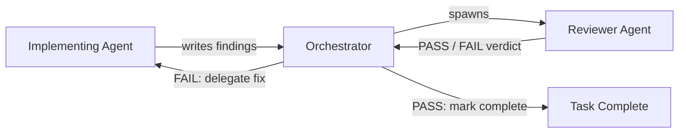

**Date:** 2026-03-02

OrqaStudio™ uses an agentic development model: one orchestrator coordinates, and specialized subagents implement. This page defines the team structure, each agent's role, the knowledge available to them, and how review gates work.

---

## Team Model

| Role | Participant | Responsibilities |
| ------ | ------------- | ----------------- |
| **Product Manager** | User (human) | Defines vision, pillars, priorities. Approves feature scope. Makes decisions when product principles conflict. |
| **Tech Lead** | User (human) | Approves implementation plans before coding begins. Reviews architecture decisions. Provides technical oversight. Final authority on technical approach. |
| **Scrum Master / Dev Lead** | Orchestrator (main AI session) | Creates teams, delegates tasks to background agents via TaskCreate/Agent, gates on DoR/DoD, reads findings files, commits completed work. |
| **Implementation Team** | Specialized agents | Implement delegated tasks end-to-end. Load knowledge. Run quality checks. Write findings to `.state/` files. |

The Product Manager and Tech Lead roles may be filled by the same person if they have the skillset. Both are human gates — no implementation proceeds without explicit user approval of the plan.

The orchestrator does NOT implement code directly. Its job is coordination, delegation, and gating. See Orchestration for the full orchestrator protocol.

---

## Agent Directory

All 8 universal roles are defined below. Each role is invoked via the Agent tool with `run_in_background: true` and the appropriate `subagent_type`. Domain capability is loaded via knowledge at delegation time.

| Role | Purpose | Tier 1 Knowledge | When to Use |
| ------ | --------- | --------------- | ------------- |
| **Orchestrator** | Coordinates work, enforces process, manages governance | `orqa-code-search`, `composability`, `planning`, `governance-maintenance` | Session coordination, task lifecycle, governance artifact management |
| **Researcher** | Investigates questions, gathers information, analyses findings | `orqa-code-search`, `composability`, `planning` | Before planning, when understanding is needed; produces research documents |
| **Planner** | Designs approaches, evaluates tradeoffs, maps dependencies | `orqa-code-search`, `composability`, `planning`, `architecture` | Before implementation; cross-boundary features; produces implementation plans in epics |
| **Implementer** | Does the work — code, deliverables, whatever "work" means | `orqa-code-search`, `composability` + domain knowledge loaded by orchestrator | Rust backend, Svelte frontend, database, build, refactoring |
| **Reviewer** | Reads code/artifacts, verifies acceptance criteria with evidence, produces PASS/FAIL verdict. Does NOT fix issues. | `orqa-code-search`, `composability` + review knowledge loaded by orchestrator | Code quality, AC verification, security audits — every completed task requires Reviewer PASS |
| **Writer** | Creates documentation, specifications, communications | `orqa-code-search`, `composability`, `planning` | Architecture docs, IPC contracts, component specs, process documentation |
| **Designer** | Designs experiences, interfaces, and structures | `orqa-code-search`, `composability`, `svelte5-best-practices`, `tailwind-design-system` | UI components, styling, visual polish, design system |
| **Governance Steward** | Creates and updates `.orqa/` governance artifacts | — | Artifact cleanup, schema validation, process documentation in `.orqa/` |

**Governance Steward tool constraints:**

| Constraint | Value |
| ---------- | ----- |
| Can edit | `.orqa/` artifacts only |
| Can run shell | No |
| Artifact scope | `.orqa/` artifacts only — no source code, no docs outside `.orqa/` |

Orchestrator-injected Tier 2 knowledge narrows the Implementer and Reviewer roles to specific domains.

---

## Knowledge Directory

Knowledge artifacts are domain-specific instruction sets. They must be portable — no OrqaStudio-specific architectural rules in knowledge artifacts.

| Knowledge | Domain | Loaded By |
| ------- | -------- | ----------- |
| `search` | Unified search: search_regex, search_semantic, search_research via orqastudio MCP | ALL agents |
| `planning` | Discuss-Agree-Plan-Approve-Implement-Verify methodology | orchestrator, planner, researcher, writer |
| `governance-maintenance` | Governance artifact lifecycle, schema validation, process docs | orchestrator (governance work) |
| `architecture` | ADR pattern, data flow mapping, architectural violations | Planner, Writer |
| `svelte5-best-practices` | Svelte 5 runes ($state, $derived, $effect), component patterns | Implementer (frontend), Designer, Reviewer |
| `typescript-advanced-types` | Strict TypeScript, readonly types, string literal unions | Implementer (frontend), Reviewer |
| `tailwind-design-system` | Tailwind CSS utilities, theme variables, design tokens | Implementer (frontend), Designer, Reviewer (UX) |
| `rust-async-patterns` | Rust async/await, tokio, error handling, lifetimes | Implementer (backend), Reviewer |
| `tauri-v2` | Tauri v2 commands, Channel&lt;T&gt;, plugins, security model | Implementer (backend), Planner, Reviewer |

---

## Review Gates

Every completed task MUST be reviewed by a Reviewer agent before it is marked complete. The implementing agent does not self-certify.

The Reviewer is a separate agent spawned by the orchestrator after the implementer writes its findings. The Reviewer:

- Reads the implementation and verifies each acceptance criterion with evidence
- Produces a PASS or FAIL verdict with specific evidence for each AC
- Does NOT fix issues — failures are sent back to the implementer

Review failures generate entries in Implementation Lessons. The orchestrator promotes recurring failures to rules.

---

## Content Ownership

Each layer of the governance system owns a specific type of content. For the full framework, see Content Governance.

| Layer | Owns |
| ------- | ------ |
| `.orqa/documentation/` | Standards, IPC contracts, architecture decisions — source of truth |
| `.orqa/learning/rules/` | Behavioral enforcement rules — promoted from recurring lessons |
| `.orqa/learning/lessons/` | Implementation lessons with recurrence tracking |
| `.orqa/learning/decisions/` | Architecture and principle decisions with rationale |

---

## Related Documents

- Orchestration -- Orchestrator responsibilities and context discipline
- Workflow -- Task lifecycle from start to complete
- Content Governance -- The six-layer ownership model
- Skills Log -- Full skill inventory with provenance and dates
- Definition of Ready -- What must be true before implementation starts
- Definition of Done -- What must be true before a task is marked complete
