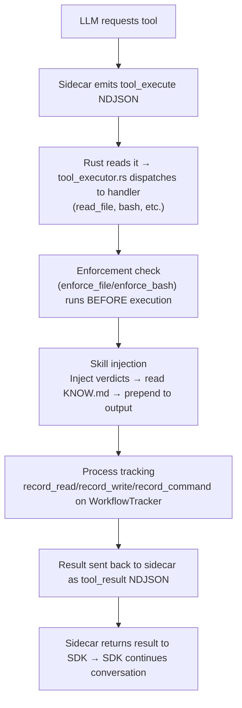
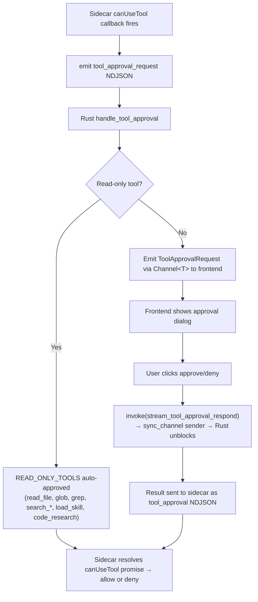

# Core Application Architecture

This document maps the entire OrqaStudio core application end-to-end. It covers seven major systems, each traced from entry point through processing to persistence and display.

## Technology Stack

- **Backend**: Rust (Tauri v2) — `app/src-tauri/src/`
- **Frontend**: Svelte 5 + TypeScript — `ui/src/lib/`
- **Sidecar**: Bun/Node TypeScript — `plugins/claude-integration/app/src-tauri/src/sidecar/`
- **Database**: SQLite (rusqlite) — conversation persistence
- **File System**: `.orqa/` directory tree — governance artifacts
- **IPC**: Tauri `invoke()` — the ONLY frontend-backend interface

## Architecture Overview

```mermaid
graph TD
    subgraph Frontend["Frontend (Svelte 5 Runes)"]
        Stores["Stores (.svelte.ts)"]
        Components["Components (.svelte)"]
    end

    subgraph Backend["Backend (Rust / Tauri v2)"]
        Commands["commands/"]
        Domain["domain/"]
        Repo["repo/"]
        SidecarMgr["SidecarManager (state.rs)"]
    end

    subgraph SidecarLayer["Sidecar (Bun TypeScript)"]
        Sidecar["NDJSON stdin/stdout"]
        AgentSDK["Claude Agent SDK"]
        ClaudeAPI["Claude API"]
    end

    subgraph Persistence
        SQLite["SQLite<br/>sessions, messages, tokens, settings, projects"]
        FileSystem[".orqa/ file system<br/>governance artifacts (rules, skills, etc.)"]
    end

    Stores -->|invoke()| Commands
    Commands --> Domain
    Domain --> Repo
    Domain --> SidecarMgr
    SidecarMgr -->|NDJSON| Sidecar
    Sidecar --> AgentSDK
    AgentSDK --> ClaudeAPI
    Commands -->|Channel&lt;T&gt; StreamEvents| Components
    Repo --> SQLite
    Domain --> FileSystem
```

## AppState Decomposition

The `AppState` struct (`app/src-tauri/src/state.rs`) is decomposed into 7 sub-structs, each owning a domain:

| Sub-struct | Contents | Purpose |
| ----------- | ---------- | --------- |
| `DbState` | `Mutex\<Connection\>` | SQLite connection (sessions, messages, settings) |
| `SidecarState` | `SidecarManager` + `pending_approvals: DashMap` | Sidecar process lifecycle + tool approval channels |
| `SearchState` | `Mutex<Option\<SearchEngine\>>` | ONNX+DuckDB code search (lazy init) |
| `StartupState` | `Arc\<StartupTracker\>` | Async startup task tracking |
| `EnforcementState` | `Mutex<Option\<EnforcementEngine\>>` | Compiled enforcement rules |
| `SessionState` | `process_state: Mutex\<SessionProcessState\>` + `workflow_tracker: Mutex\<WorkflowTracker\>` | Per-session process compliance tracking |
| `ArtifactState` | `watcher` + `graph: Mutex<Option\<ArtifactGraph\>>` + `skill_injector: Mutex<Option\<SkillInjector\>>` | File watcher + artifact graph + semantic skill matching |

---

## System 1: Artifact System

### Overview

The artifact system scans `.orqa/` directories, builds a bidirectional graph of artifact relationships, and renders a navigable tree in the UI.

### Entry Points

| Layer | Entry Point | File |
| ------- | ------------ | ------ |
| Frontend | `artifactStore.loadNavTree()` | `ui/src/lib/stores/artifact.svelte.ts` |
| Backend | `#[tauri::command] artifact_scan_tree` | `app/src-tauri/src/commands/artifact_commands.rs` |

### Processing Pipeline

1. **Config loading**: Read `project.json` → `artifacts` array defines what directories to scan
2. **Tree scanning** (`artifact_reader.rs`):
   - Walk each configured path (groups expand to children)
   - For each directory: read `schema.json` for filterable/sortable fields, `_navigation.json` for defaults
   - For each `.md` file: extract YAML frontmatter for title, status, description
   - Skills get special handling (subdirectories with `KNOW.md`)
   - Hooks get special handling (`.sh` files)
   - Documentation directories are recursively scanned into `DocNode` trees
   - `README.md` frontmatter provides default icon, label, description, sort order for directories
3. **Graph construction** (`artifact_graph.rs`):
   - **Forward-only relationship storage**: Artifacts store only forward relationships (e.g., task stores `delivers: epic`, but epic does NOT store `delivered-by: task`). The graph computes inverses at query time.
   - Two-pass algorithm:
     - **Pass 1**: Walk all `.orqa/**/*.md` files, extract `id` from frontmatter, collect forward refs from `SINGLE_REF_FIELDS` and `ARRAY_REF_FIELDS`
     - **Pass 2**: Compute inverse references from forward refs to create queryable backlinks
   - Result: `ArtifactGraph { nodes: HashMap<id, ArtifactNode>, path_index: HashMap<path, id> }`
   - `graph_stats()` computes node_count, edge_count, orphan_count, broken_ref_count

### Persistence

- **No persistence** — the nav tree and graph are computed on demand from the file system
- File system (`.orqa/`) IS the persistence layer for all governance artifacts
- Graph is cached in `AppState.artifacts.graph: Mutex<Option\<ArtifactGraph\>>`

### Display

- `NavigationStore` resolves config keys to `NavType` entries from the tree
- `navigationStore.navigateToArtifact(id)` resolves an artifact ID → path via the graph SDK → sets the active view
- `navigationStore.navigateToPath(path)` walks the NavTree recursively to find matching nodes
- Explorer view: `artifact-list` (list of nodes) or `artifact-viewer` (markdown content)

### Key Types

| Type | File | Purpose |
| ------ | ------ | --------- |
| `NavTree` / `NavGroup` / `NavType` / `DocNode` | `domain/artifact.rs` | Navigation hierarchy |
| `ArtifactGraph` / `ArtifactNode` / `ArtifactRef` | `domain/artifact_graph.rs` | Bidirectional reference graph |
| `ArtifactEntry` (config) | `domain/artifact.rs` | Config-driven directory entries |
| `NavigationConfig` / `NavReadme` | `domain/artifact.rs` | Per-directory navigation metadata |

---

## System 2: Streaming Pipeline

### Overview

The streaming pipeline carries messages from the LLM provider through the sidecar child process, through Rust, to the Svelte frontend — with tool execution and approval flowing back upstream.

### Entry Points

| Layer | Entry Point | File |
| ------- | ------------ | ------ |
| Frontend | `conversationStore.sendMessage()` | `ui/src/lib/stores/conversation.svelte.ts` |
| Backend | `#[tauri::command] stream_send_message` | `app/src-tauri/src/commands/stream_commands.rs` |
| Sidecar | `handleRequest()` on stdin readline | `plugins/claude-integration/app/src-tauri/src/sidecar/index.ts` |

### Processing Pipeline

**Downstream (user message → LLM):**

1. **Frontend**: `conversationStore.sendMessage(content)` calls `invoke("stream_send_message", { sessionId, content, onEvent: channel })`
2. **Rust command** (`stream_commands.rs`):

   a. Persist user message to SQLite via `message_repo::create`
   b. Reset session process state (`SessionProcessState` + `WorkflowTracker`)
   c. Ensure sidecar is running (`ensure_sidecar`)
   d. Build system prompt from governance artifacts (`build_system_prompt`)
   e. Load context messages (up to 20 recent text messages)
   f. Emit `SystemPromptSent` event via `Channel\<T\>`
   g. Emit `ContextInjected` event with message count + total chars
   h. Send `SendMessage` request to sidecar via NDJSON stdin
   i. Enter `run_stream_loop()` — blocking read from sidecar stdout

3. **Sidecar** (`index.ts` → `claude-agent.ts`):

   a. Parse NDJSON request
   b. Call `query()` from `@anthropic-ai/claude-agent-sdk` which spawns the Claude Code CLI
   c. Pass system prompt, model, abort controller, resume session ID
   d. For each SDK message: `translateAgentMessage()` → emit `text_delta`, `thinking_delta`, `tool_use_start`, etc. as NDJSON responses

**Upstream (LLM responses → frontend):**

1. **Sidecar** writes NDJSON responses to stdout
2. **Rust stream loop** (`stream_loop.rs`):

   a. `read_line()` from sidecar stdout
   b. `translate_response()`: `SidecarResponse` → `StreamEvent` (skips HealthOk, SummaryResult, SessionInitialized, ToolExecute)
   c. Emit `StreamEvent` via `Channel\<T\>` to frontend
   d. Special handling for `ToolExecute` → `handle_tool_execute()` → dispatch to `tool_executor.rs`
   e. Special handling for `ToolApprovalRequest` → `handle_tool_approval()` → auto-approve read-only tools, block on `sync_channel` for write tools
   f. At `TurnComplete`: run `evaluate_stop_gates()` → emit `ProcessViolation` events
   g. Persist assistant message, update token usage

3. **Frontend** (`conversation.svelte.ts`):
   - `handleStreamEvent()` switch on `StreamEvent.type`:
     - `text_delta` → append to `streamingContent`
     - `thinking_delta` → append to `streamingThinking`
     - `tool_use_start` → add to `activeToolCalls` (SvelteMap)
     - `tool_result` → update tool call in map
     - `tool_approval_request` → set `pendingApproval` (triggers UI dialog)
     - `turn_complete` → finalize message, clear streaming state
     - `process_violation` → add to `processViolations` array
     - `session_title_updated` → update session title
     - `context_injected` → add to `contextEntries`

### Tool Execution Flow



### Tool Approval Flow



### Session Resumption

- Sidecar captures provider session UUID from SDK init message → emits `session_initialized`
- Rust persists the mapping: `session_repo::update_provider_session_id`
- On next message: Rust sends `provider_session_id` in `SendMessage` request
- Sidecar passes `resume: providerSessionId` to `query()` options

### Key Types

| Type | File | Purpose |
| ------ | ------ | --------- |
| `SidecarRequest` / `SidecarResponse` | `sidecar/types.rs` + `protocol.ts` | Wire protocol (mirrored Rust↔TS) |
| `StreamEvent` | `domain/provider_event.rs` | Rust→Frontend events via Channel\<T\> |
| `SidecarManager` | `sidecar/manager.rs` | Child process lifecycle (spawn/send/read/kill) |

---

## System 3: Enforcement Pipeline

### Overview

The enforcement pipeline loads rules from `.orqa/process/rules/`, compiles their enforcement entries into regex patterns, and evaluates them at tool execution time (file writes, bash commands) and governance scan time.

> **Architecture note (v2):** In the plugin-composed architecture, enforcement rules are migrated to knowledge plugin artifacts with injection tier metadata. The Rust enforcement engine remains for the Tauri app path, but CLI sessions use the plugin-composed prompt pipeline instead. See System 4 for the new prompt generation pipeline.

### Entry Points

| Layer | Entry Point | File |
| ------- | ------------ | ------ |
| Loading | `enforcement_parser::parse_rule_content()` | `domain/enforcement_parser.rs` |
| Runtime (file) | `enforcement_engine.evaluate_file()` | `domain/enforcement_engine.rs` |
| Runtime (bash) | `enforcement_engine.evaluate_bash()` | `domain/enforcement_engine.rs` |
| Scanning | `enforcement_engine.scan()` | `domain/enforcement_engine.rs` |
| Frontend | `enforcementStore.loadRules()` | `ui/src/lib/stores/enforcement.svelte.ts` |

### Processing Pipeline

1. **Rule loading** (`enforcement_parser.rs`):
   - Read `.orqa/process/rules/*.md` files
   - Split frontmatter from prose body
   - Parse YAML frontmatter via serde: extract `scope`, `enforcement[]` entries
   - Each entry has: `event` (File/Bash/Scan/Lint), `action` (Block/Warn/Inject), `conditions[]` (field+pattern), optional `pattern`, optional `scope` (glob), optional `skills[]`
   - Returns `EnforcementRule { name, scope, entries, prose }`

2. **Engine compilation** (`enforcement_engine.rs`):
   - `EnforcementEngine::new(rules)` compiles all condition patterns into `Regex` objects
   - Stores compiled entries as `Vec\<CompiledEntry\>` with pre-compiled regex for fast matching
   - Lint entries are stored but skipped during evaluation (declarative documentation only)

3. **Runtime evaluation**:
   - **`evaluate_file(file_path, new_text)`**: For each File-event entry, check all conditions (AND logic — all must match). Conditions match against `file_path` or `new_text` fields.
   - **`evaluate_bash(command)`**: For each Bash-event entry, check the `pattern` against the command string.
   - Returns `Vec\<Verdict\>` with `rule_name`, `action` (Block/Warn/Inject), `message`, and optional `skills[]`

4. **Tool executor integration** (`tool_executor.rs`):
   - `enforce_file()` runs before `write_file` and `edit_file` tools
   - `enforce_bash()` runs before `bash` tool
   - **Block** verdicts: tool execution is prevented, error message returned
   - **Warn** verdicts: warning prepended to tool output, execution continues
   - **Inject** verdicts: skill KNOW.md content read from disk, prepended to tool output (deduplicated via `WorkflowTracker.mark_skill_injected()`)

5. **Governance scanning** (`enforcement_engine.scan(project_path)`):
   - Evaluates Scan-event entries across project files
   - Uses `scope` field as glob pattern to select files
   - Returns `Vec\<ScanFinding\>` with file path, line number, matched pattern

### Process Gates (Separate from Enforcement Engine)

Process gates (`process_gates.rs`) fire at tool execution time and turn completion. They use `WorkflowTracker` state, not enforcement rules:

| Gate | Event | Condition | Message |
| ------ | ------- | ----------- | --------- |
| `understand-first` | write (code file) | No research done, fires once per session | "THINK FIRST: What is the system..." |
| `docs-before-code` | write (code file) | No docs read this session | "DOCUMENTATION CHECK..." |
| `plan-before-build` | write (code file) | No planning artifacts read | "PLANNING CHECK..." |
| `evidence-before-done` | stop (turn complete) | Code written but no verification command run | "VERIFICATION CHECK..." |
| `learn-after-doing` | stop (turn complete) | >3 code writes but lessons not checked | "LEARNING CHECK..." |

### Persistence

- Enforcement rules are loaded from disk (`.orqa/process/rules/*.md`)
- Compiled engine cached in `AppState.enforcement: Mutex<Option\<EnforcementEngine\>>`
- WorkflowTracker is ephemeral (per-session, lost on restart)

### Display

- `enforcementStore` exposes `rules[]` and `violations[]` with derived `blockCount` and `warnCount`
- Commands: `enforcement_rules_list`, `enforcement_rules_reload`
- Process violations emitted as `ProcessViolation` StreamEvents → shown in conversation UI

### Key Types

| Type | File | Purpose |
| ------ | ------ | --------- |
| `EnforcementRule` / `EnforcementEntry` / `Condition` | `domain/enforcement.rs` | Rule domain model |
| `EventType` (File/Bash/Scan/Lint) | `domain/enforcement.rs` | Event classification |
| `RuleAction` (Block/Warn/Inject) | `domain/enforcement.rs` | Action classification |
| `Verdict` | `domain/enforcement.rs` | Evaluation result |
| `EnforcementEngine` | `domain/enforcement_engine.rs` | Compiled regex evaluator |
| `WorkflowTracker` | `domain/workflow_tracker.rs` | Session-level event accumulator |
| `GateResult` | `domain/process_gates.rs` | Process gate evaluation result |

---

## System 4: Prompt Generation Pipeline (Plugin-Composed)

### Overview

The prompt generation system has two layers: the **legacy Rust path** (system_prompt.rs, used by the Tauri app) and the **new plugin-composed pipeline** (`libs/cli/src/lib/prompt-pipeline.ts`, used by CLI sessions and the target architecture). The plugin-composed pipeline replaces monolithic "load everything" with a five-stage pipeline that generates role-specific, token-budgeted, KV-cache-aware prompts from plugin registries.

### Architecture: Five-Stage Pipeline

```text
Plugin Registry --> Schema Assembly --> Section Resolution --> Token Budgeting --> Prompt Output
```

**Stage 1 -- Plugin Registry** (`prompt-registry.ts`):

- Scans installed plugins for `knowledge_declarations` and `prompt_sections` in `orqa-plugin.json` manifests
- Builds a cached registry at `orqa plugin install` time, written to `.orqa/prompt-registry.json`
- Runtime reads only the cached registry, never raw plugin manifests
- Classifies each entry by source: `project-rules` > `project-knowledge` > `plugin` > `core`

**Stage 2 -- Schema Assembly** (`prompt-pipeline.ts::assembleSchema`):

- For a (role, workflow-stage, task) tuple, queries the registry for applicable sections
- Knowledge entries filtered by injection tier:
  - **always** tier: matched by role and/or file path globs
  - **stage-triggered** tier: matched when the workflow stage matches
  - **on-demand** tier: not returned by query -- retrieved via semantic search at runtime
- Conflict resolution: when two entries share the same ID, the higher-priority source wins
- Task context added as a dynamic section with P1 priority

**Stage 3 -- Section Resolution** (`prompt-pipeline.ts::resolveSections`):

- Loads content from disk for file-backed sections
- Falls back to inline summaries (100-150 tokens) when files are unavailable
- Follows cross-references at depth 1 via `{{ref:ARTIFACT-ID}}` pattern
- Detects and breaks circular references

**Stage 4 -- Token Budgeting** (`prompt-pipeline.ts::applyTokenBudget`):

- Default budgets per role: Orchestrator 2,500 / Implementer 2,800 / Reviewer 1,900 / Writer 1,800
- Trim order: P3 sections first, then P2, then P1. **P0 sections are never trimmed.**
- Within same priority, largest sections trimmed first
- Returns both included and trimmed section lists for diagnostics

**Stage 5 -- Prompt Output** (`prompt-pipeline.ts::assemblePrompt`):

- KV-cache-aware zone ordering: static core at top, dynamic content at bottom
- Zone order: role-definition > safety-rule > constraint > stage-instruction > knowledge > task-template > task-context
- Uses Claude XML tags for structure (`<role>`, `<knowledge id="...">`, `<task-context>`)
- Appends on-demand knowledge preamble when on-demand entries exist

### Knowledge Injection Tiers

| Tier | When Loaded | Token Budget | Source |
| ------ | ------------- | ------------- | -------- |
| **always** | At agent spawn for matching roles/paths | 200-500 tokens (compressed summary) | Plugin `knowledge_declarations` with `tier: "always"` |
| **stage-triggered** | When workflow enters a matching stage | 500-1,000 tokens | Plugin `knowledge_declarations` with `tier: "stage-triggered"` |
| **on-demand** | Agent queries semantic search at runtime | 1,000-2,000 tokens (full artifact) | `knowledge-retrieval.ts` or MCP search tools |

### On-Demand Knowledge Retrieval (`knowledge-retrieval.ts`)

- Generates a preamble instructing agents to use `mcp__orqastudio__search_semantic` for on-demand retrieval
- Provides disk-based fallback that reads from `.orqa/process/knowledge/` directories
- Filters by tags, role, and text content within a configurable token budget

### Legacy Path (Tauri App)

The Rust-based system prompt assembly (`system_prompt.rs`) remains for the Tauri app:

1. Read all `.orqa/rules/*.md` files (full content)
2. List knowledge catalog (name + first line only)
3. Read `.claude/CLAUDE.md` (full content)
4. Read `AGENTS.md` (full content)
5. Concatenate all parts

This path will be replaced by the plugin-composed pipeline once the daemon integrates the TypeScript prompt generation.

### Entry Points

| Layer | Entry Point | File |
| ------- | ------------ | ------ |
| Plugin-composed pipeline | `generatePrompt(options)` | `libs/cli/src/lib/prompt-pipeline.ts` |
| Plugin-composed registry | `buildPromptRegistry(projectRoot)` | `libs/cli/src/lib/prompt-registry.ts` |
| Plugin-composed knowledge | `retrieveKnowledge(projectPath, options)` | `libs/cli/src/lib/knowledge-retrieval.ts` |
| Legacy (Rust) | `build_system_prompt(project_path)` | `domain/system_prompt.rs` |
| Sidecar | `TOOL_SYSTEM_PROMPT` constant | `providers/claude-agent.ts` |

### Key Types

| Type | File | Purpose |
| ------ | ------ | --------- |
| `PromptRegistry` / `RegistryKnowledgeEntry` | `libs/cli/src/lib/prompt-registry.ts` | Cached plugin prompt contributions |
| `PromptResult` / `ResolvedSection` | `libs/cli/src/lib/prompt-pipeline.ts` | Pipeline output with diagnostics |
| `KnowledgeDeclaration` / `PromptSection` | `libs/types/src/plugin.ts` | Plugin manifest schema types |
| `KnowledgeInjectionTier` / `PromptPriority` | `libs/types/src/plugin.ts` | Injection tier and priority enums |
| `ContextMessage` | `domain/system_prompt.rs` | Legacy condensed message for context injection |
| `SkillInjector` / `SkillMatch` | `domain/skill_injector.rs` | Legacy semantic skill matching (ONNX) |

---

## System 5: Learning Loop

### Overview

The learning loop captures implementation lessons as markdown files, tracks recurrence, and promotes frequently-recurring patterns to rules or skill updates.

### Entry Points

| Layer | Entry Point | File |
| ------- | ------------ | ------ |
| Frontend | `lessonStore.loadLessons()` | `ui/src/lib/stores/lessons.svelte.ts` |
| Backend | `#[tauri::command] lessons_list` | `app/src-tauri/src/commands/lesson_commands.rs` |
| Repo | `lesson_repo::list()` | `app/src-tauri/src/repo/lesson_repo.rs` |

### Processing Pipeline

1. **Lesson creation** (`lesson_repo::create`):
   - Scan existing `IMPL-NNN.md` files to determine next ID
   - Create `Lesson` struct with `recurrence: 1`, `status: active`
   - Render to markdown via `render_lesson()` (YAML frontmatter + body)
   - Write to `.orqa/process/lessons/IMPL-NNN.md`

2. **Lesson parsing** (`lessons.rs::parse_lesson`):
   - Split frontmatter from body via `---` delimiters
   - Extract fields: id, title, category, recurrence, status, promoted-to, created, updated
   - Manual YAML parsing via `extract_field()` / `extract_nullable_field()`

3. **Recurrence tracking** (`lesson_repo::increment_recurrence`):
   - Read existing lesson file → parse → increment recurrence → update `updated` date → write back
   - Frontend: `lessonStore.incrementRecurrence(projectPath, id)`

4. **Promotion pipeline** (process-level, not automated in code):
   - `promotionCandidates` getter: lessons with `recurrence >= 2` and `status: active`
   - Promotion: set `promoted_to` field to target artifact (RULE-NNN, skill update)
   - Update `status: promoted`

5. **Process gate integration**:
   - `learn-after-doing` gate fires at turn end when >3 code writes but lessons not checked
   - WorkflowTracker detects reads of `.orqa/process/lessons/` to suppress the gate

### Persistence

- **File-based**: `.orqa/process/lessons/IMPL-NNN.md` (YAML frontmatter + markdown body)
- **NOT in SQLite** — lessons are governance artifacts, not conversation data

### Display

- `lessonStore`: `lessons[]`, `loading`, `error`, `promotionCandidates` (derived)
- Commands: `lessons_list`, `lessons_create`, `lesson_increment_recurrence`

### Key Types

| Type | File | Purpose |
| ------ | ------ | --------- |
| `Lesson` | `domain/lessons.rs` | Lesson domain model |
| `NewLesson` | `domain/lessons.rs` | Input for creation |

---

## System 6: Frontend Store → Command Mapping

Every frontend store communicates with the Rust backend exclusively through `invoke()`. This is the complete mapping.

### `conversationStore` (conversation.svelte.ts)

| Store Method | Tauri Command | Direction |
| ------------- | --------------- | ----------- |
| `sendMessage()` | `stream_send_message` | invoke + Channel\<T\> streaming |
| `stopStreaming()` | `stream_stop` | invoke |
| `respondToApproval()` | `stream_tool_approval_respond` | invoke |
| `loadMessages()` | `message_list` | invoke |

### `sessionStore` (session.svelte.ts)

| Store Method | Tauri Command |
| ------------- | --------------- |
| `loadSessions()` | `session_list` |
| `createSession()` | `session_create` |
| `selectSession()` | `session_get` |
| `restoreSession()` | `session_get` |
| `updateTitle()` | `session_update_title` |
| `endSession()` | `session_end` |
| `deleteSession()` | `session_delete` |
| `persistActiveSessionId()` | `settings_set` |
| `clearPersistedSessionId()` | `settings_set` |

### `projectStore` (project.svelte.ts)

| Store Method | Tauri Command |
| ------------- | --------------- |
| `loadActiveProject()` | `project_get_active` |
| `openProject()` | `project_open` |
| `loadProjects()` | `project_list` |
| `loadProjectSettings()` | `project_settings_read` |
| `saveProjectSettings()` | `project_settings_write` |
| `scanProject()` | `project_scan` |
| `uploadIcon()` | `project_icon_upload` |
| `loadIcon()` | `project_icon_read` |
| `checkIsOrqaProject()` | `project_settings_read` |

### `artifactStore` (artifact.svelte.ts)

| Store Method | Tauri Command |
| ------------- | --------------- |
| `loadNavTree()` | `artifact_scan_tree` |
| Content loading | Delegated to `artifactGraphSDK` |

### `enforcementStore` (enforcement.svelte.ts)

| Store Method | Tauri Command |
| ------------- | --------------- |
| `loadRules()` | `enforcement_rules_list` |
| `reloadRules()` | `enforcement_rules_reload` + `enforcement_rules_list` |

### `lessonStore` (lessons.svelte.ts)

| Store Method | Tauri Command |
| ------------- | --------------- |
| `loadLessons()` | `lessons_list` |
| `createLesson()` | `lessons_create` |
| `incrementRecurrence()` | `lesson_increment_recurrence` |

### `settingsStore` (settings.svelte.ts)

| Store Method | Tauri Command |
| ------------- | --------------- |
| `loadAllSettings()` | `settings_get_all` |
| `setThemeMode()` | `settings_set` |
| `setDefaultModel()` | `settings_set` |
| `setFontSize()` | `settings_set` |
| `refreshSidecarStatus()` | `sidecar_status` + `get_startup_status` |
| `restartSidecar()` | `sidecar_restart` |

### `setupStore` (setup.svelte.ts)

| Store Method | Tauri Command |
| ------------- | --------------- |
| `checkSetupStatus()` | `get_setup_status` |
| `checkCli()` | `check_claude_cli` |
| `checkAuth()` | `check_claude_auth` |
| `checkEmbeddingModel()` | `check_embedding_model` |
| `reauthenticate()` | `reauthenticate_claude` |
| `completeSetup()` | `complete_setup` |

### `governanceStore` (governance.svelte.ts)

| Store Method | Tauri Command |
| ------------- | --------------- |
| `scan()` | `governance_scan` |
| `checkExistingAnalysis()` | `governance_analysis_get` |
| `analyze()` | `governance_analyze` |
| `loadRecommendations()` | `recommendations_list` |
| `approve()` | `recommendation_update` |
| `reject()` | `recommendation_update` |
| `apply()` | `recommendation_apply` |
| `applyAll()` | `recommendations_apply_all` |

### `navigationStore` (navigation.svelte.ts)

- **No Tauri commands** — purely frontend state management
- Reads from `artifactStore.navTree` and `projectStore.artifactConfig`
- Manages: `activeActivity`, `activeGroup`, `explorerView`, `selectedArtifactPath`, `breadcrumbs`

### `errorStore` (errors.svelte.ts)

- **No Tauri commands** — listens to `app-error` Tauri events + window error handlers
- Manages: reactive error list with auto-dismiss (8s timeout)

---

## System 7: Session & Project Lifecycle

### Project Lifecycle

**Opening a project:**

1. **First launch**: `settingsStore.initialize()` → `projectStore.loadActiveProject()` → `invoke("project_get_active")`
2. **project_get_active** reads `last_project_id` from settings table → loads project from SQLite
3. If no active project → show welcome/project picker screen
4. **Opening a new project**: `projectStore.openProject(path)` → `invoke("project_open", { path })`
   - `project_open` command: scan directory for stack detection → upsert SQLite record → return `Project`
5. **Post-open**: `loadProjectSettings(path)` → reads `.orqa/project.json` from disk
   - Settings include: `artifacts` array, `model`, `dogfood` flag, `icon`, project metadata

**Project scanning:**

- `projectStore.scanProject(path)` → `invoke("project_scan")` → `DetectedStack { languages, frameworks, package_manager, has_claude_config }`

### Session Lifecycle

**Creating a session:**

1. `sessionStore.createSession(projectId, model)` → `invoke("session_create")`
2. `session_repo::create` inserts into SQLite: `(project_id, model, system_prompt)` → returns `Session`
3. Session status: `Active`
4. `persistActiveSessionId()` stores `last_session_id` in settings for restore

**Resuming a session:**

1. On app load: `settingsStore.loadAllSettings()` reads `last_session_id`
2. `sessionStore.restoreSession(lastSessionId)` → `invoke("session_get")`
3. If session exists → set as active; if not → clear persisted ID

**During a session (streaming):**

1. Each `stream_send_message` call:
   - Persists user message → resets process state → builds system prompt
   - Sends to sidecar with `provider_session_id` for conversation continuity
   - Stream loop processes responses → persists assistant message → updates tokens
2. Auto-title: after first assistant response, backend generates summary via sidecar
   - `session_repo::auto_update_title` only updates if `title_manually_set = false`
   - Frontend receives `SessionTitleUpdated` event → `sessionStore.handleTitleUpdate()`

**Ending a session:**

1. `sessionStore.endSession(sessionId)` → `invoke("session_end")`
2. `session_repo::end_session` sets `status = 'completed'`

**Deleting a session:**

1. `sessionStore.deleteSession(sessionId)` → optimistic UI removal → `invoke("session_delete")`
2. `session_repo::delete` cascades to messages table

### SQLite Schema (Session-Related)

| Table | Key Columns |
| ------- | ------------ |
| `projects` | id, name, path, stack_json, created_at |
| `sessions` | id, project_id (FK), title, model, system_prompt, status, total_input_tokens, total_output_tokens, provider_session_id, title_manually_set |
| `messages` | id, session_id (FK), role, content, content_type, turn_index, block_index, tool_call_id |
| `settings` | id, key, value, scope |

### Startup Sequence

On app launch (`lib.rs`):

1. Initialize SQLite database (create tables if needed)
2. Construct `AppState` with all 7 sub-structs
3. Auto-start sidecar process
4. Download/verify ONNX embedding model (async, tracked by `StartupTracker`)
5. Register all 39 Tauri commands across 10 command modules

### Key Types

| Type | File | Purpose |
| ------ | ------ | --------- |
| `Session` / `SessionSummary` / `SessionStatus` | `domain/session.rs` | Session domain model |
| `Project` / `ProjectSummary` / `DetectedStack` | `domain/project.rs` | Project domain model |
| `ProjectSettings` | `domain/project_settings.rs` | File-based project config |

---

## System 8: Plugin-Composed Workflow Engine

### Overview

The workflow engine evaluates plugin-owned YAML state machines for artifact types. Plugins define complete state machines with states, transitions, guards, actions, gates, and variants. The core framework provides the evaluation engine and primitives; plugins provide the definitions. This replaces hardcoded status values and informal workflow tracking.

### Architecture

**Plugin ownership**: The plugin that defines an artifact type owns its complete state machine. There is no inheritance model -- each plugin's state machine is self-contained.

**Composition model**: Workflow-definition plugins define a skeleton with named contribution points (slots). Stage-definition plugins fill those slots via declarative manifests. The composition happens at `orqa plugin install` time, not runtime.

**Resolved files**: After merging, resolved workflows are written to `.orqa/workflows/<name>.resolved.yaml`. The runtime reads only resolved files.

### State Categories

The core framework defines five state categories; plugins map their states to categories:

| Category | Purpose | UI Treatment |
| ---------- | --------- | ------------- |
| `planning` | Work being designed/scoped | Blue indicators |
| `active` | Work in progress | Green indicators |
| `review` | Work being reviewed | Amber indicators |
| `completed` | Work finished | Purple indicators |
| `terminal` | Final state, no further transitions | Gray indicators |

### Guard Primitives

| Guard Type | Purpose | Parameters |
| ----------- | --------- | ----------- |
| `field_check` | Check artifact field values | `field`, `operator` (exists/equals/matches/in/etc.), `value` |
| `relationship_check` | Check relationship existence or target status | `relationship_type`, `condition` (exists/min_count/all_targets_in_status) |
| `query` | Run a graph query | `query_name`, `expected_result` (empty/non_empty/count_equals/etc.) |
| `role_check` | Verify actor role | `roles` array |
| `code_hook` | Delegate to custom code | `hook` name, optional `args` |

### Action Primitives

| Action Type | Purpose | Parameters |
| ------------ | --------- | ----------- |
| `set_field` | Update artifact fields | `field`, `value` |
| `append_log` | Add to audit trail | `message`, optional `log_field` |
| `create_artifact` | Create a related artifact | `artifact_type`, optional `template`/`relationship` |
| `notify` | Send notification | `channel` (ui/log/hook), `message`, `severity` |
| `code_hook` | Delegate to custom code | `hook` name, optional `args` |

### Human Gates (Five-Phase Pipeline)

Gates are structured sub-workflows, not boolean flags:

1. **GATHER** -- Collect data from fields, run pre-checks, generate summary
2. **PRESENT** -- Show inputs in structured format with context
3. **COLLECT** -- Reviewer provides verdict + rationale
4. **EXECUTE** -- Apply transition, run post-transition actions, log to audit trail
5. **LEARN** -- On FAIL: create/update lesson, track recurrence. On PASS: track cycle time.

Five gate patterns: simple_approval, structured_review, multi_reviewer, escalation, scope_decision.

### Workflow Variants

Ad-hoc workflow patterns for scenarios that skip full pipeline stages:

| Variant | Scenario | Difference |
| --------- | ---------- | ----------- |
| `task-quickfix` | Bug fix, UX tweak | Skip planning, automated review only |
| `task-security` | Security fix | Skip planning, mandatory human review |
| `task-docs-only` | Documentation fix | Skip review entirely |
| `task-hotfix` | Production hotfix | Skip planning, expedited review |

Workflow selection rules in plugin manifests automatically assign variants based on artifact properties (priority, labels, scope).

### Entry Points

| Layer | Entry Point | File |
| ------- | ------------ | ------ |
| Workflow Resolver | `resolveAll(projectRoot)` | `libs/cli/src/lib/workflow-resolver.ts` |
| Type Definitions | `WorkflowDefinition` | `libs/types/src/workflow.ts` |
| Plugin Schema | `provides.workflow_definitions` | `orqa-plugin.json` manifests |

### Key Types

| Type | File | Purpose |
| ------ | ------ | --------- |
| `WorkflowDefinition` | `libs/types/src/workflow.ts` | Complete state machine for an artifact type |
| `WorkflowState` / `Transition` | `libs/types/src/workflow.ts` | State and transition definitions |
| `Guard` / `GuardType` | `libs/types/src/workflow.ts` | Declarative guard system |
| `Action` / `ActionType` | `libs/types/src/workflow.ts` | Transition action system |
| `Gate` / `GatePattern` / `GatePhases` | `libs/types/src/workflow.ts` | Human gate sub-workflows |
| `WorkflowVariant` / `SelectionRule` | `libs/types/src/workflow.ts` | Ad-hoc variant support |
| `ContributionPoint` | `libs/types/src/workflow.ts` | Skeleton composition slots |

---

## System 9: Agent Lifecycle and Token Economy

### Overview

The agent lifecycle system implements ephemeral, task-scoped agents spawned from generated prompts. It replaces persistent agents and session-long lifecycles with the three-layer taxonomy: Universal Role + Stage Context + Domain Knowledge = Effective Agent.

### Agent Spawning (`agent-spawner.ts`)

1. **Role assignment** -- 8 universal roles: orchestrator, implementer, reviewer, researcher, planner, writer, designer, governance_steward
2. **Model tier selection** -- Default tier per role (Opus for orchestrator/planner, Sonnet for others), with complexity-based upgrade (implementer upgrades to Opus for complex tasks)
3. **Prompt generation** -- Calls the five-stage pipeline with (role, stage, task) tuple
4. **Tool constraints** -- Each role has declarative constraints scoping which tools it can use and on which artifact types
5. **Findings path** -- Agents write structured findings to `.state/team/<team>/task-<id>.md`

### Model Tiering

| Role | Default Tier | Upgrade Condition |
| ------ | ------------- | ------------------- |
| Orchestrator | Opus | N/A |
| Planner | Opus | N/A |
| Implementer | Sonnet | Complex tasks --> Opus |
| Reviewer | Sonnet | N/A |
| Researcher | Sonnet | N/A |
| Writer | Sonnet | N/A |
| Designer | Sonnet | N/A |
| Governance Steward | Sonnet | N/A |

### Token Tracking (`token-tracker.ts`)

Four-level metrics capture, all written to `.state/token-metrics.jsonl`:

| Level | Scope | Metrics |
| ------- | ------- | --------- |
| 1 | Per-Request | input/output tokens, cache hit rate, reasoning tokens, latency, model |
| 2 | Per-Agent | total tokens, context utilization, request count, lifetime |
| 3 | Per-Session | total tokens, cost, agent spawns, overhead ratio, team spawn cost |
| 4 | Trends | 7/30-day aggregates computed from historical data |

### Budget Enforcement (`budget-enforcer.ts`)

| Budget | Default | Enforcement |
| -------- | --------- | ------------- |
| Per-agent prompt tokens | 4,000 | Hard block if exceeded |
| Per-agent total tokens | 100,000 | Hard block, with warnings at 75%/90% |
| Per-session total tokens | 500,000 | Hard block, with model downgrade suggestions |
| Per-session cost (USD) | $5.00 | Hard block, with model downgrade suggestions |

The enforcer suggests model tier downgrades at 75% and 90% thresholds.

### Findings-to-Disk Format

Findings documents use YAML frontmatter headers (~200 tokens) that the orchestrator reads without loading full body content:

```yaml
status: "complete"          # complete | blocked | partial
summary: "What was done"
changed_files: ["path/to/file"]
follow_ups: ["Item needing attention"]
```

### Key Types

| Type | File | Purpose |
| ------ | ------ | --------- |
| `UniversalRole` / `ModelTier` | `libs/cli/src/lib/agent-spawner.ts` | Role and model tier enums |
| `AgentSpawnConfig` / `CreateAgentParams` | `libs/cli/src/lib/agent-spawner.ts` | Agent configuration |
| `ToolConstraint` / `ROLE_TOOL_CONSTRAINTS` | `libs/cli/src/lib/agent-spawner.ts` | Role-based tool permissions |
| `FindingsHeader` / `FindingsDocument` | `libs/cli/src/lib/agent-spawner.ts` | Structured findings format |
| `TokenTracker` / `RequestMetrics` | `libs/cli/src/lib/token-tracker.ts` | Session-level token tracking |
| `BudgetEnforcer` / `BudgetConfig` | `libs/cli/src/lib/budget-enforcer.ts` | Budget enforcement |
| `COST_PER_MTOK` | `libs/cli/src/lib/budget-enforcer.ts` | Model tier pricing |

---

## Module Map

### Backend Rust Modules (`app/src-tauri/src/`)

| Module | Purpose |
| -------- | --------- |
| `lib.rs` | App initialization, command registration (39 commands) |
| `state.rs` | AppState with 7 sub-structs |
| `error.rs` | `OrqaError` enum with `thiserror` |
| `db.rs` | SQLite initialization and migrations |
| **commands/** | |
| `stream_commands.rs` | `stream_send_message`, `stream_stop`, `stream_tool_approval_respond` |
| `session_commands.rs` | CRUD for sessions |
| `message_commands.rs` | Message listing |
| `project_commands.rs` | Project open/list/scan |
| `artifact_commands.rs` | Nav tree scanning, graph stats |
| `enforcement_commands.rs` | Rule listing/reload |
| `lesson_commands.rs` | Lesson CRUD + recurrence |
| `settings_commands.rs` | Key-value settings |
| `setup_commands.rs` | CLI detection, auth, model download |
| `governance_commands.rs` | Governance scanning + analysis |
| **domain/** | |
| `artifact.rs` | Core artifact types, frontmatter parsing |
| `artifact_reader.rs` | Config-driven nav tree scanner |
| `artifact_graph.rs` | Bidirectional reference graph |
| `artifact_fs.rs` | Filesystem helpers for artifacts |
| `enforcement.rs` | Enforcement domain types |
| `enforcement_engine.rs` | Compiled regex evaluator |
| `enforcement_parser.rs` | Rule YAML parsing |
| `process_gates.rs` | Process compliance gates |
| `workflow_tracker.rs` | Session-level event accumulator |
| `skill_injector.rs` | Semantic skill matching (ONNX) |
| `system_prompt.rs` | System prompt assembly |
| `stream_loop.rs` | Sidecar response processing loop |
| `tool_executor.rs` | Tool dispatch + enforcement + path sandboxing |
| `provider_event.rs` | StreamEvent enum (Rust→Frontend) |
| `session.rs` | Session domain model |
| `message.rs` | Message domain model |
| `project.rs` | Project domain model |
| `lessons.rs` | Lesson parsing/rendering |
| `session_title.rs` | Auto-title generation |
| `watcher.rs` | File system watcher |
| **sidecar/** | |
| `types.rs` | SidecarRequest/SidecarResponse wire types |
| `protocol.rs` | NDJSON serialization |
| `manager.rs` | SidecarManager (child process lifecycle) |
| **repo/** | |
| `session_repo.rs` | Session SQLite operations |
| `message_repo.rs` | Message SQLite operations |
| `project_repo.rs` | Project SQLite operations |
| `lesson_repo.rs` | Lesson file operations |
| `settings_repo.rs` | Settings key-value store |
| **search/** | |
| `types.rs` | Search result types |
| `embedder.rs` | ONNX Runtime embedding |
| `store.rs` | DuckDB vector storage |
| `chunker.rs` | Code chunking |

### Frontend Stores (`ui/src/lib/stores/`)

| Store | Commands Used | State Managed |
| ------- | ------------- | --------------- |
| `conversation.svelte.ts` | 4 commands | messages, streaming state, tool calls, approvals |
| `session.svelte.ts` | 7 commands | sessions list, active session |
| `project.svelte.ts` | 9 commands | active project, settings, scanning |
| `artifact.svelte.ts` | 1 command | nav tree, active content |
| `enforcement.svelte.ts` | 2 commands | rules, violations |
| `lessons.svelte.ts` | 3 commands | lessons list |
| `settings.svelte.ts` | 5 commands | theme, model, font, sidecar status, startup |
| `setup.svelte.ts` | 5 commands | setup wizard state |
| `governance.svelte.ts` | 7 commands | scan results, analysis, recommendations |
| `navigation.svelte.ts` | 0 commands | UI navigation state (frontend-only) |
| `errors.svelte.ts` | 0 commands | Error collection (event-driven) |

### Sidecar (`plugins/claude-integration/app/src-tauri/src/sidecar/`)

| File | Purpose |
| ------ | --------- |
| `index.ts` | NDJSON readline loop, request dispatch |
| `protocol.ts` | Type definitions + parse/serialize helpers |
| `provider.ts` | Facade re-exporting default provider methods |
| `provider-interface.ts` | Provider interface definition |
| `providers/claude-agent.ts` | Claude Agent SDK integration, tool routing, session management |
| `providers/index.ts` | Provider factory |
