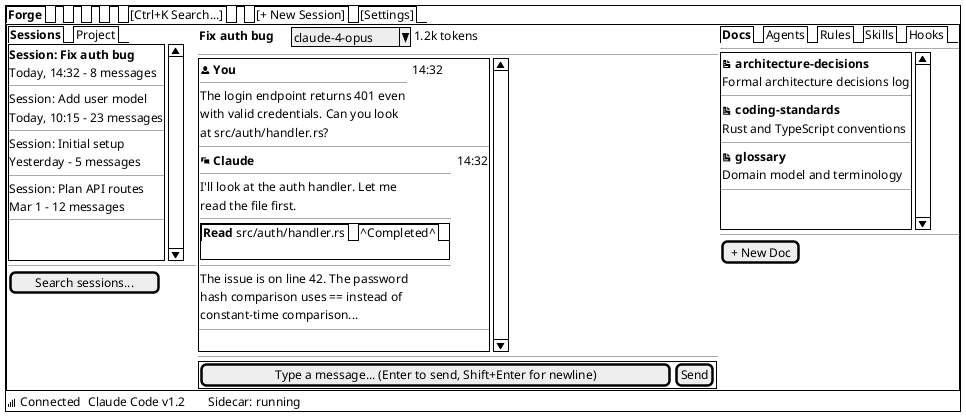
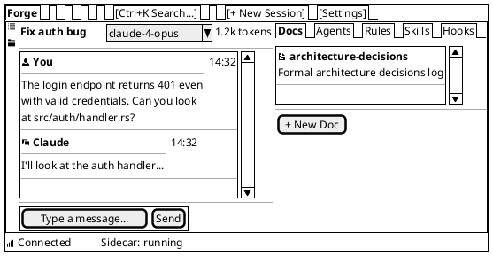
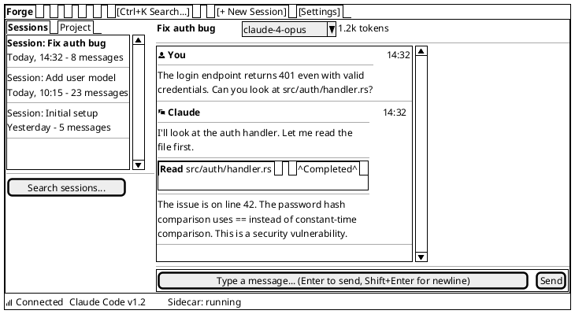
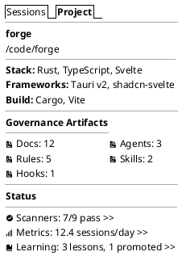

# Wireframe: Core Layout

**Date:** 2026-03-02 | **Informed by:** [Information Architecture](/product/information-architecture), [Frontend Research](/research/frontend), [Design System](/ui/design-system)

The main window structure showing all three panes, toolbar, and status bar in their default state.

---

## Default State (All Panels Open)

### Panel Dimensions

| Pane | Default | Min | Max | Collapsible |
|------|---------|-----|-----|-------------|
| Sidebar | 240px | 180px | 320px | Yes (left edge) |
| Primary | Flex (fills remaining) | 400px | — | No |
| Detail | 360px | 280px | 480px | Yes (right edge) |
| Toolbar | Full width | — | — | No |
| Status Bar | Full width | — | — | No |

### Panel Collapse Behavior

When the sidebar collapses, it reduces to a narrow icon strip (48px) showing session/project tab icons. Click any icon to expand.

When the detail panel collapses, the primary panel expands to fill the space. The detail panel can be restored via `Ctrl+\` or clicking the settings gear / artifact link.

---

## Sidebar Collapsed State

---

## Detail Panel Collapsed State

---

## Sidebar: Project Tab

---

## Element Descriptions

### Toolbar

| Element | Behavior |
|---------|----------|
| **Project name** ("Forge") | Click opens project switcher dropdown. Shows current project name. |
| **Search** | `Ctrl+K` focuses. FTS5-powered search across sessions and artifacts. Results appear in detail panel. |
| **New Session** | Creates a new conversation session and focuses the input area. `Ctrl+N`. |
| **Settings** | Opens the settings view in the detail panel. |

### Status Bar

| Element | Behavior |
|---------|----------|
| **Connection indicator** | Green dot = connected. Red dot = disconnected. Click to view connection details. |
| **Claude Code version** | Shows the detected CLI version. |
| **Sidecar status** | "running", "idle", "error". Shows current sidecar process state. |

### Resize Handles

PaneForge provides drag handles between panes. Handles are 1px borders with an 8px invisible drag target. Double-click a handle to collapse/expand the adjacent pane.

---

## Keyboard Navigation

| Shortcut | Action |
|----------|--------|
| `Ctrl+B` | Toggle sidebar |
| `Ctrl+\` | Toggle detail panel |
| `Ctrl+K` | Focus global search |
| `Ctrl+N` | New session |
| `Tab` | Move focus between panes (Sidebar > Primary > Detail) |
